# Model Promotion Pipeline – Report


Github Repository: [MLOPS model promotion pipeline](https://github.com/PaulZaman/MLOPS-model-promotion-pipeline)

Course: MLOps EFREI S9

Instructor: HAMMOUD Khodor

Student: Paul Zamanian


## Task 1 – Candidate → Staging Workflow


### Trigger workflow

The workflow was launched manually from GitHub Actions:

GitHub → Actions → Candidate to Staging → Run workflow

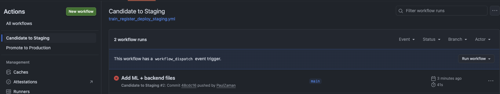

### Training and logging

The pipeline successfully trained the Logistic Regression model, computed accuracy, logged metrics to MLflow, and registered a new model version.

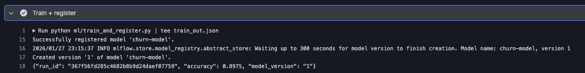

### Gate evaluation

The quality gate checks:

- accuracy >= 0.90
- Observed result:
- accuracy = 0.8975

Since the accuracy is below the threshold, the gate failed and the deployment was stopped.

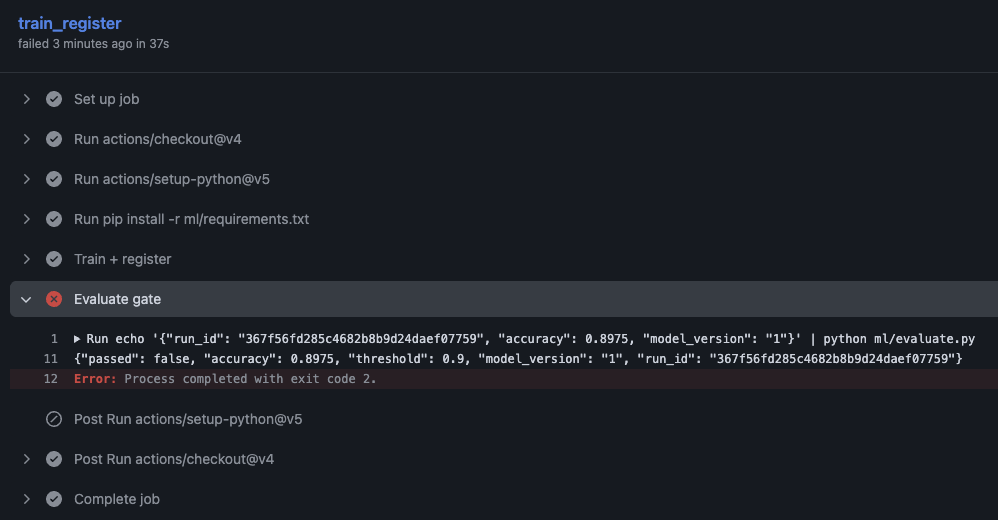

### Model registry verification

Even though staging deployment was blocked, the model was still registered in MLflow.

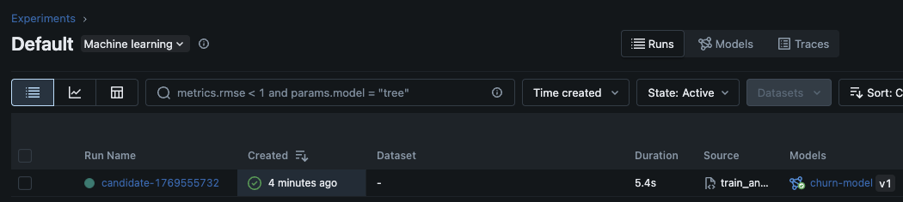

### MLflow Experiment created

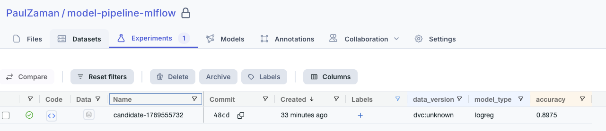

- Model version number: **1**

- Accuracy: **0.8975**

- Did the gate pass? **No (Failed)**

## Task 2 – What does “Staging” prove?

Staging validates aspects of the model that offline evaluation alone cannot guarantee.
While offline testing only measures metrics such as accuracy on a dataset, staging tests the real deployment environment.


Staging ensures that:

- model can be correctly loaded from the MLflow registry
- API server starts successfully
- model serves predictions through the `/predict` endpoint
- input/output schemas are compatible with the application
- dependencies and environment configuration are correct
- latency and runtime behavior are acceptable
- integration with Docker and deployment infrastructure works

Offline evaluation answers:
> Is the model statistically good?

Staging answers:
> Does the model actually work in production-like conditions?


## Task 3 – Promote to Production

### Trigger workflow

The workflow was launched manually from GitHub Actions:

GitHub → Actions → Promote to Production → Run workflow  
Input:
model_version = 1

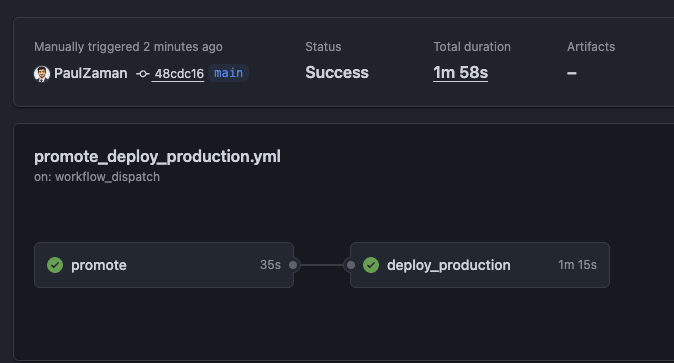


### Registry transition

The workflow updated the MLflow registry. This means the registry now marks this model as the official production model.

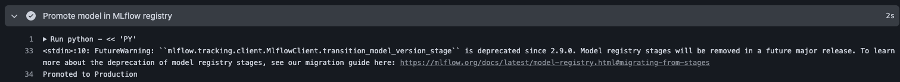
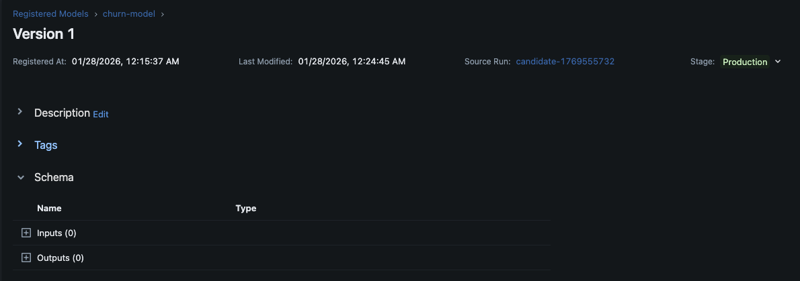


### Deployment

After promotion, the pipeline:

- built the Docker image
- pushed the production image
- deployed the backend using the Production model

This confirms the deployment step executed successfully.

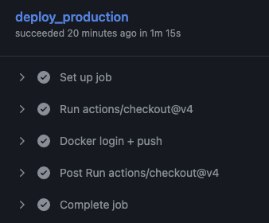

We can even see the Docker image in Dockerhub :


## Task 4 – Prove production uses registry stage, not "latest code"

In order to have a model for staging that passes the gate, I modified the accuracy threshold in `ml/evaluate.py` from 0.90 to 0.85 and retrained the model.

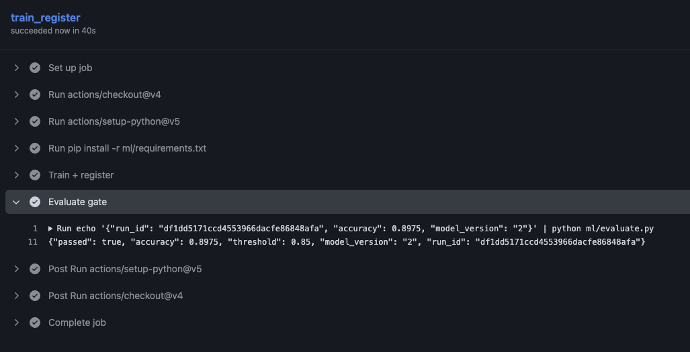

Now we have both versions of model in the registry:

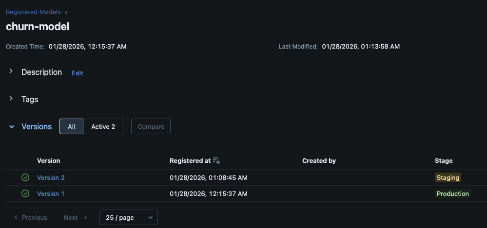


Now we can run both staging and production workflows to see that they use the correct versions from the registry.

```bash
docker compose --env-file .env -f deploy/docker-compose.production.yml up --build
docker compose --env-file .env -f deploy/docker-compose.staging.yml up --build
```

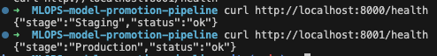

## Discussion Questions

### 1. Why is it dangerous to deploy "whatever just merged to main" as the model?

It is dangerous because code may be untested and the model quality not validated. This breaks reproducibility and creates risk of pushing a bad model to production.

### 2. What does the registry stage give you that a Git tag does not?

The registry stage tracks model artifacts, not just code. It allows explicit promotion (from staging to production), and easy rollback between versions. This creates a clear separation between training and deployment.

### 3. If staging passes but production fails, what could be the causes?

There can be multiple causes, but the most common ones are related to differences between staging and production environments or data. 
It can also be Latency/resource limits if the production environment has stricter performance requirements than staging.

### 4. Where should DVC fit in a serious pipeline:

DVC should be used to version all important datasets to ensure experiments are reproducible and comparable.
The training data snapshot guarantees models can be retrained exactly.
The evaluation dataset snapshot ensures fair and consistent comparisons.
The drift reference dataset helps detect when production data changes over time.

### 5. What should be added to the gate beyond accuracy?

Accuracy alone is not enough to guarantee a good production model.
Latency ensures the model is fast enough for real-time use.
Schema checks prevent crashes from input format changes.
Fairness constraints reduce bias and unethical behavior.
Robustness tests ensure the model remains stable under noisy or adversarial inputs.